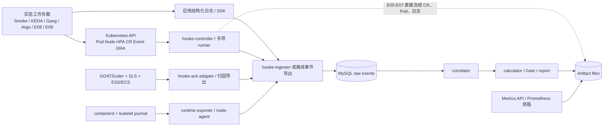
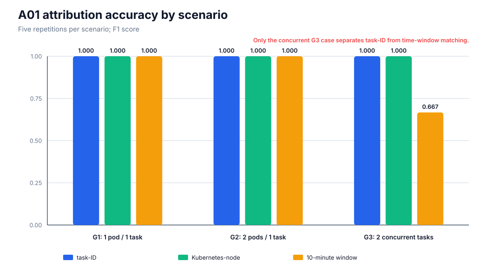
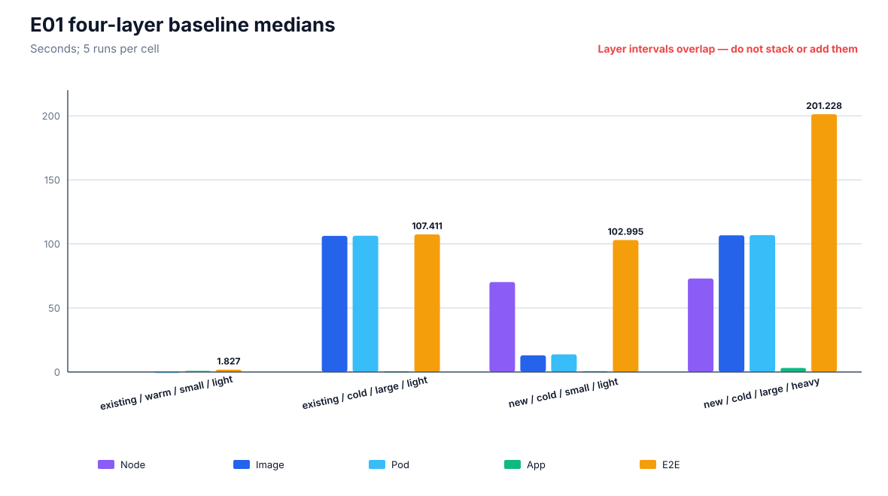
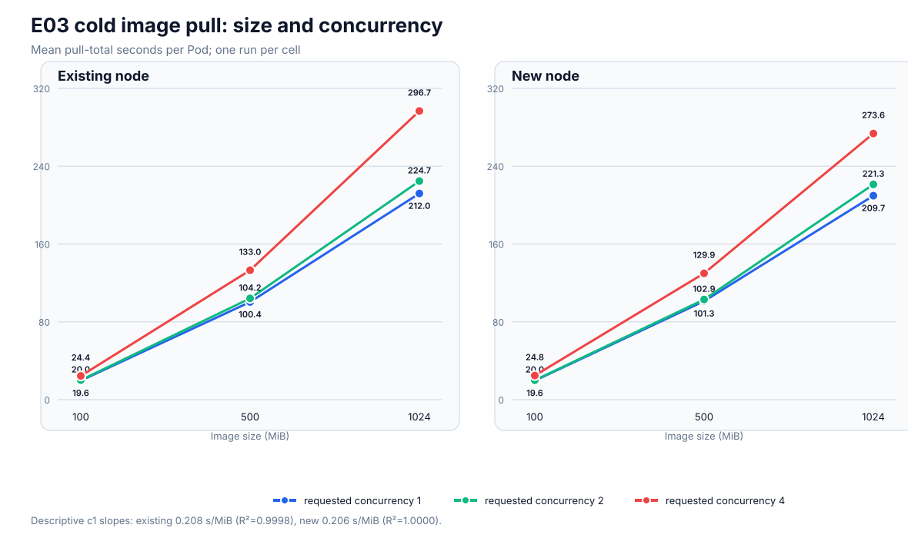
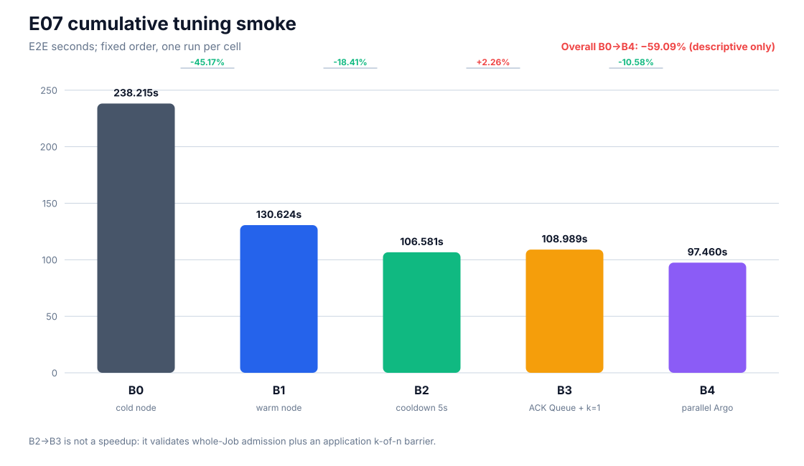
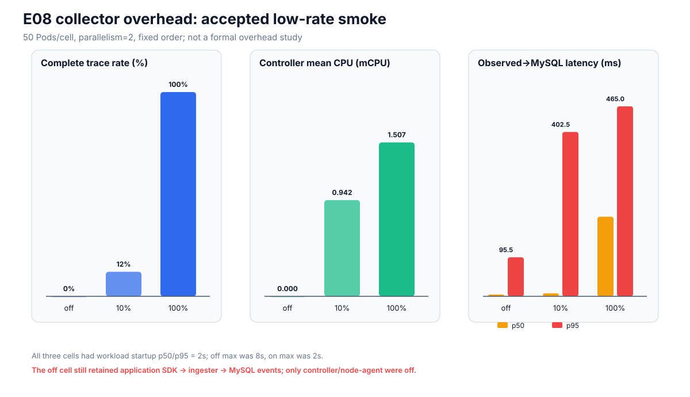
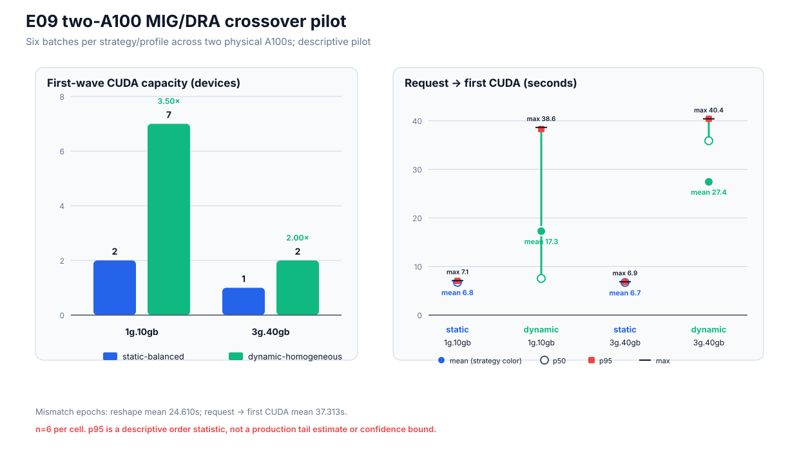

# Cloud Elastic Pilot 全实验分支结果汇总与综合分析

> 报告日期：2026-07-30
>
> 实验时间统一按 UTC；报告覆盖 `experiment/01-*` 至 `experiment/11-*` 共 11 个 Git 分支。
>
> 结论范围：真实 ACK CPU 与 GPU 阶段的工程可行性、Pilot 量级和方向性证据；不把冒烟或小规模 Pilot 包装成正式统计结论。

## 0. 执行摘要

11 个实验分支的最终 Gate 全部通过，但证据成熟度并不相同：A01 归因实验、E01 四层基线和 E09 两 A100 交叉对照达到受控重复 Pilot 级别；其余主要是单次或单区组的功能冒烟。E09 先完成单 A100 功能链，再在两张物理 A100 上交换静态/动态角色，每个策略/profile 获得 6 个批次，但需求顺序固定且只有两张卡。当前没有任何实验达到预定的每 cell 至少 30 次、随机区组、置信区间和跨环境复现要求，因此不能报告生产级 p95/p99、统计显著性、最优参数或成本收益。

可以较有把握接受的核心结论如下：

1. **真实 ACK 事件链已经闭环。** Kubernetes API、GOATScaler/SLS、containerd/kubelet journal、应用源时间日志、MySQL、关联器和计算器能够形成 Node、Image、Pod、App 四层证据；E01 的 20/20 条轨迹主层均为精确来源。
2. **并发供应必须使用 task-ID 归因。** A01 的 G3 在 5/5 次运行中均产生两个并发 task；task-ID 与事后 Kubernetes-node 关联的 F1 都为 1.0，而“10 分钟内第一个 Ready Node”方法稳定只有 0.667，并把第二波 Pod 错配给第一波节点。
3. **冷路径的主要长尾来自 Node 与 Image。** E01 中 warm-small existing 路径的 E2E 中位数只有 1.827 秒；new-cold-small 为 102.995 秒，new-cold-large-heavy 为 201.228 秒。E03 的描述性拟合显示单路冷拉取约为 0.206–0.208 秒/MiB；1024 MiB 镜像单 Pod 平均约 210–212 秒。
4. **warm Node 的方向性收益最大。** E02 在同一节点、相同 digest、相同冷镜像和相同资源条件下，warm-node 将 E2E 从 112.382 秒降至 14.661 秒，单对减少 97.721 秒（86.95%）。E07 的独立累积冒烟中，cold→warm 也减少 107.591 秒；但两项都尚未形成统计分布和成本模型。
5. **镜像缓存与拉取并发操纵真实有效。** E03 的 9 个 warm cell 下载字节和实际 pull 都为 0；18 个 cold cell 的实际并发均等于请求值。并发 2 的单 Pod 时延只小幅增加，并发 4 的单 Pod 时延平均增加约 28%–32%，说明高并发存在共享网络/磁盘/解包竞争。
6. **KEDA cooldown 与 Argo DAG 的控制效果方向清晰。** E04 的 60/300 秒 cooldown 分别观测为 55.028/295.032 秒，偏差与 5 秒轮询同量级；E06 中并行 B/C 将 Workflow 从 71 秒降至 60 秒，E07 中同类修改带来 11.529 秒的单次 E2E 下降。
7. **ACK Queue 1.26.3 没有证明调度器部分准入。** QueueUnit 始终按完整 `n` 请求配额，`k-of-n` 只在应用 barrier 层实现。E07 的 B2→B3 单次 E2E 反而增加 2.408 秒，因此当前证据只支持功能语义，不支持性能收益或资源节省。
8. **E08 只证明低速冒烟下采集链无丢队列。** 10%/100% 模式均满足 `kept=enqueued=sent`，没有 queue-full、invalid 或 delivery-error；controller 平均 CPU 为 0.942/1.507 mCPU。但该实验没有执行高启动率、8/16 节点、KS 检验或 Bootstrap CI，不能声称生产开销可忽略。
9. **E09 闭环了真实 A100 的 MIG→DRA→CUDA 路径，并暴露容量—重构时延权衡。** 单 A100 冒烟验证 `all-disabled→7×1g.10gb→CUDA→整卡恢复`；两 A100 交叉 Pilot 中，动态同构 geometry 对 `1g.10gb`/`3g.40gb` 的首波容量为 7/2，静态均衡为 2/1，即 3.5×/2.0×。但 profile mismatch 的平均 MIG 重构为 24.610 秒，请求到首次 CUDA 平均 37.313 秒；该结果只适用于本次固定序列，不能直接推出生产策略。

## 1. 实验导航、范围与判定方法

本报告按“无需打开分支报告也能理解实验”的原则组织。只想快速了解项目时，阅读下表即可知道每个实验要解决的问题、实际做法、得到的答案和证据边界；第 3 节给出完整结果与分析。各小节末尾的分支报告和 artifact 链接仅用于复核原始证据，不是理解本报告的前置材料。

### 1.1 十一个实验分别在回答什么

| 实验 | 核心问题 | 对照与规模 | 本次得到的答案 | 证据边界 |
|---|---|---|---|---|
| 分支 01：基础复现 | Cloud Elastic Pilot 能否在真实 ACK 上采集固定节点与真实扩容路径，并形成 Node、Image、Pod、App 关联结果？ | 3 次固定节点冒烟；另一次 Run 同时包含 3 条固定路径和 3 条触发真实节点扩容的路径，共 9 条完整轨迹 | Kubernetes、ACK 节点扩缩容、事件落库、关联、Gate 和回收链路可以闭环；固定路径主要受 App/readiness 影响，扩容路径主要等待 Node | L1；Node 使用 Kubernetes 近似边界，只证明系统链路可用，不建立精确性能基线 |
| A01：供应归因 | 多个 GOATScaler 供应 task 并发时，Pending Pod 应该归属于哪个 task？时间窗口匹配是否可靠？ | G1 单 Pod/单 task、G2 多 Pod/单 task、G3 两波 Pod/两个并发 task；17 个 Run、70 条完整轨迹；比较 task-ID、事后 Kubernetes-node 和 10 分钟时间窗口三种方法 | task-ID 和事后 Kubernetes-node 的 F1 均为 1.0；时间窗口法在 G3 稳定降至 0.667。供应归因必须使用 task-ID，Kubernetes-node 只适合作为事后校验 | L2；已覆盖重复并发场景，但 Node 分段仍是近似口径 |
| E01：四层基线 | ACK 弹性路径中，Node、Image、Pod、App 各占多少时间，瓶颈如何随路径变化？ | 4 条代表路径各 5 次：已有节点/新节点、缓存命中/冷拉取、小/大镜像、轻/重应用，共 20 条精确轨迹 | 已有节点+小镜像缓存命中时 E2E p50 为 1.827 秒；新节点+冷小镜像为 102.995 秒；新节点+冷大镜像+重应用为 201.228 秒。冷路径主要受 Node 与 Image 支配 | L2；4 个 cell 不是完整全因子设计，不能拆出每个因素的独立主效应 |
| E02：warm Node | 保留一个 Ready 节点，能否在不改变镜像拉取和应用负载的情况下缩短冷启动？ | 同一实例、同一 digest、相同资源且两次都清为冷镜像；固定顺序执行 cold-node→warm-node，1 个配对 | E2E 从 112.382 秒降至 14.661 秒，减少 97.721 秒；Image 和 Pod 时延基本不变，差异集中在跳过节点供应 | L1；只有 1 个固定顺序配对，不能外推 86.95% 为普遍收益，也没有成本模型 |
| E03：镜像缓存与并发 | 镜像大小、缓存命中、拉取并发和节点新旧如何影响 Image 时延？ | 100/500/1024 MiB，cold/warm，并发 1/2/4，existing/new；27 个 cell、63 条精确轨迹 | 9 个 warm cell 均无实际拉取；单路冷拉取约为 0.206–0.208 秒/MiB；并发 2 增幅较小，并发 4 的单 Pod 时延平均增加约 28%–32% | L1；多数 cell 只有 1 次，结果只能描述方向，不能宣布最优并发值 |
| E04：KEDA scale-to-zero | KEDA 能否把消息积压转换为扩容，并按 cooldown 将 worker 缩回 0？观测链能否还原消息与控制事件？ | cooldown 60 秒和 300 秒各 1 个 cell；每个 cell 发送 12 条消息，约 1 条/秒，每条处理 2 秒 | 24/24 条消息链完整；两个 cooldown 的 scale-to-zero 观测值分别为 55.028/295.032 秒，与 5 秒轮询粒度一致；公式管线可以运行 | L1；只验证控制语义和计算链，反解出的参数不是生产 cooldown 建议 |
| E05：ACK Queue/Gang | ACK Kube Queue 1.26.3 是否支持 `k-of-n` 部分准入，还是仍需完整 Job 配额？应用能否在第 k 个成员就绪后开始工作？ | Indexed Job 的 `n2-k1`、`n2-k2`、`n4-k4`、`n4-k2` 四个 cell；记录 QueueUnit 准入和每个 rank 的 barrier 事件 | QueueUnit 始终为完整 `n` 申请并等待配额；`n4-k2` 可在第 2 个成员 Ready 后由应用开始工作，但这属于应用 barrier，不是调度器部分准入 | L1；证明功能语义，不证明节省资源或缩短 E2E |
| E06：Argo DAG | 删除工作流中并不存在的 B→C 业务依赖，让 B/C 并行，是否能缩短关键路径和 Workflow？ | 相同 A–F 工作量；baseline 强制 B→C 串行，tuned 使用真实依赖 `A→{B,C}→D→E→F`；各 1 次 | B/C 重叠 8 秒，Workflow 从 71 秒降至 60 秒，关键路径从 6 个阶段降至 5 个；删除伪依赖的优化方向成立 | L1；单对样本，且未覆盖在线 controller→MySQL→correlator 全链路 |
| E07：端到端累积调优 | warm Node、缩短 KEDA cooldown、Queue/barrier 和 Argo 并行逐项加入后，整条业务链如何变化？ | 固定顺序 B0→B4 共 5 个 cell，依次改变 Node、cooldown、Job/`n-k` 和 Argo DAG | E2E 从 238.215 秒降至 97.460 秒；warm Node、cooldown 和 Argo 并行方向有利，Queue+应用 `k=1` 本次反而增加 2.408 秒 | L1；固定顺序累积补丁，不能把相邻差值当成独立、可相加的因果效应 |
| E08：采集器开销 | 开启基础设施事件采集后是否丢事件，以及 controller/node-agent 的资源与持久化开销如何随采样率变化？ | collector-off→10%→100% 固定顺序；每个 cell 运行 50 个 Pod、并发 2、每个工作 5 秒 | 两个 on cell 均满足 `kept=enqueued=sent` 且无队列错误；controller 平均 CPU 为 0.942/1.507 mCPU；100% 模式 MySQL 持久化 p50 升至 194.953 ms | L1；低启动率、少节点冒烟。off 仍保留应用 SDK、ingester 和 MySQL，不能据此声称生产采集开销可忽略 |
| E09：GPU/DRA/MIG | ACK 上能否安全切分并恢复 A100，由稳定 DRA 精确分配 MIG device 并完成真实 CUDA；静态混合 geometry 与动态同构 geometry 的容量和时延如何权衡？ | 单 A100 功能冒烟；两 A100 两 Period 交叉角色，12 个 demand epoch、24 个策略批次，每个策略/profile 6 个批次 | MIG Manager、`resource.k8s.io/v1` DRA、Claim/Pod/device 和 CUDA identity 闭环；动态同构容量为静态均衡的 3.5×/2.0×，但 mismatch 平均重构 24.610 秒 | L2（受控重复 Pilot）；只有两张卡、固定合成需求和 6 批次/cell，不支持生产 p99、最优策略或成本收益 |

### 1.2 快速阅读口径

- **Run** 是一次完整执行；**cell** 是一组唯一的实验参数组合。同一 cell 重复执行才形成可分析的分布。
- **existing/new Node** 表示 Pod 使用实验前已经 Ready 的节点，或触发 GOATScaler 创建新节点；**warm/cold** 必须结合上下文判断是节点已就绪，还是镜像已缓存/需要拉取。
- **E2E** 是该实验定义的业务端到端区间；Node、Image、Pod、App 是诊断分层。Image 通常包含在 Pod 区间中，各层不能简单相加。
- **精确边界** 来自 task、runtime journal 或应用源事件；**近似边界** 来自 Kubernetes Event/Watch 或秒级控制面状态，二者不能混为同一精度。
- **PASS** 表示该次实验满足预先设置的完整性和数据质量 Gate，不等于已经证明统计显著性、生产最优值或跨环境普适性。

### 1.3 分支与证据等级

证据等级定义：

- **L1 功能冒烟**：单次或单区组，通过 fail-closed Gate，只证明链路和方向；
- **L2 重复 Pilot**：每场景至少 5 次干净重复，可判断稳定方向和量级，但仍不足以形成正式尾分位或显著性结论；
- **L3 正式统计实验**：随机区组、每 cell 达到协议样本量、报告分布/CI/失败率并完成跨环境复核。本批实验中没有 L3。

| Git 分支 | Tip | 实验映射 | 有效范围 | 最终结果 | 证据等级 |
|---|---|---|---|---|---|
| `experiment/01-partial-reproduction-smoke-test` | `76cdfbd` | 基础固定节点 + 真实节点扩容 | 2 个最终 Run，9 条完整轨迹 | PASS | L1 |
| `experiment/02-attribution-pilot` | `69092ac` | A01 task-ID 归因 | G1/G2/G3 共 17 个 Run，70 条完整轨迹 | PASS | L2 |
| `experiment/03-four-layer-baseline-pilot` | `af5eff5` | E01 四层基线 | 4 cell × 5 次，20 条精确轨迹 | PASS | L2 |
| `experiment/04-node-warm-pool-pilot` | `a104861` | E02 cold/warm Node | 1 个配对区组 | PASS | L1 |
| `experiment/05-image-cache-concurrency-pilot` | `c895d9e` | E03 镜像缓存/并发 | 27 cell，63 条精确轨迹 | PASS | L1 |
| `experiment/06-keda-scale-to-zero-pilot` | `4f820fc` | 固定节点复检 + E04 KEDA | 3 次基础复检；60/300 秒各 1 次 | PASS | L1 |
| `experiment/07-kueue-gang-pilot` | `fb89301` | E05 ACK Kube Queue/Gang | 适配探针 + 1×4 cell | PASS | L1 |
| `experiment/08-argo-workflow-pilot` | `cfe0e56` | E06 Argo DAG | baseline/tuned 各 1 次 | PASS | L1 |
| `experiment/09-end-to-end-tuning-pilot` | `f9d0afb` | E07 累积调优 | 固定顺序 1×5 cell | PASS | L1 |
| `experiment/10-collector-overhead-pilot` | `03d165d` | E08 采集器开销 | off→10%→100%，各 50 Pod | PASS | L1 |
| `experiment/11-gpu-dra-mig-smoke` | `f6359e8` | E09 GPU/DRA/MIG | 单 A100 冒烟；两 A100、12 epoch、24 策略批次 | PASS | L2 |

### 1.4 数据采用原则

本报告按以下优先级使用证据：

1. 已接受会话的 `summary.json`、`observations.tsv`、对象快照和原始事件；
2. 实验分支最终报告；
3. 失败会话只用于解释修复和风险，不进入性能汇总；
4. 相同实验存在首次结果和干净复跑时，只采用干净复跑作为最终数值；
5. 精确、近似、操作机单调时钟和控制面秒级时间严格分开，不把不同定义的“Node 时延”画在同一比较图上；
6. `Image` 区间通常包含在 `Pod` 区间内，各层可能重叠，不能直接相加；
7. `not_applicable` 不按 0 秒样本处理；warm cache hit 作为中性因子和单独命中率记录。
8. E09 的首波容量只统计 25 秒 admission window 内仍持有 Claim 的 CUDA 成功 Pod；MIG Manager 负责改变 geometry，DRA 只分配重构后发布的设备，不能把 reshape 时延归因给 DRA allocation。

弹性分数沿用指标字典的 `exp(-R/B)` 形式，其中 `R` 为相应时延，`B` 为 SLO。该分数对口径非常敏感；样本少或边界近似时只用于验证计算链，不用于生产排名。详细定义见[指标字典](../../metric/hooke_ack_metric_catalog.md)。

## 2. 实验环境、组件与数据链

### 2.1 共同环境

| 项目 | 实际使用情况 |
|---|---|
| 云平台 | 阿里云 ACK Managed Kubernetes / Managed Pro，地域均为 `cn-wulanchabu` |
| Kubernetes | 所有已接受报告均为 `v1.36.1-aliyun.1` |
| GPU 扩展 | E09 使用 `NVIDIA A100-SXM4-80GB`、ACK 预装 driver `580.126.09`、GPU Operator `v26.3.3`、NVIDIA DRA driver `v0.4.1` 和稳定版 `resource.k8s.io/v1` |
| 节点 OS | 主要为 Alibaba Cloud Linux 4.0.3（OpenAnolis Edition） |
| Kernel / Runtime | 后期集群统一记录为 `6.6.102-5.3.1.alnx4.x86_64` / containerd `2.1.9` |
| 节点网络 | 早期实验明确为 Flannel；新节点多次暴露 Node Ready 后 `/run/flannel/subnet.env` 尚未生成的问题 |
| 镜像仓库 | 同地域 ACR 个人版；E01 以后工作镜像普遍固定到不可变 digest |
| 节点弹性 | GOATScaler + ACK 节点池 + ESS/ECS；E01 记录版本 `v0.6.2-9186193`，不能假设所有集群版本完全相同 |
| 事件存储 | 早期实验主要使用本地 Docker MySQL 8.4；E08 与 E09 单卡使用集群内隔离临时 MySQL，两卡 E09 Pilot 不部署 MySQL。E08 未冻结数据库镜像，E09 单卡结果未写明实际数据库 image/version |
| 时间 | Run 元数据和报告统一 UTC；同进程 E2E 优先使用 `CLOCK_MONOTONIC`；跨组件墙钟保留 source/observed time 和 approximate 标记 |
| 观测 | Kubernetes Watch/Event、GOATScaler/SLS、ESS/ECS、containerd/kubelet journal、应用结构化日志、KEDA external metrics、Metrics API |
| Prometheus | 属于设计中的旁路观测面，但本批 accepted 报告的主证据主要不是 Prometheus 时序；未做跨分支 Prometheus 汇总 |

### 2.2 集群演进

实验跨越 7 个实际 ACK 集群，不能把不同时期的绝对时延当作同一硬件上的纵向回归。

| 分支/实验 | ACK cluster ID | 主要节点与池 | 备注 |
|---|---|---|---|
| 01 基础冒烟 | `c061d99ce379f4e37a9ff97e027a36ca6` | 2 个初始节点；默认池 `min=1,max=5` | 固定节点报告为 `ecs.c7.xlarge`；扩容新增 `ecs.u2i-c1m1.xlarge` |
| 02 A01 | `c6fda2390918a4086bad884e8086557bc` | 2 个基线节点，实验扩到 3/4 | 新节点为 `ecs.u2i-c1m1.xlarge`，覆盖 b/c 可用区 |
| 03 E01 | `c29d758c0c7434b94af9e03aaa592acdd` | 4 个固定节点；弹性池 `min=0,max=4` | 节点快照显示 `ecs.u2i-c1m1.xlarge`；20 次 runtime journal 精确采集 |
| 04–05 E02/E03 | `cc224c25bf1e5423a802315aff201c15c` | 专用池 `min=0,max=1` | E02 使用 `ecs.c7.large`；E03 使用 `ecs.c7.xlarge`；E03 后续复核时集群已不存在 |
| 06–07 E04/E05 | `c1c5437d0c5264255926d4a28f8c67c20` | 固定节点 `.83`，`ecs.u2i-c1m1.xlarge` | KEDA 与 ACK Kube Queue 功能冒烟 |
| 08–10 E06/E07/E08 | `c315f2d1276d34e9faf9bd2f17e8ef53b` | `np382...`，4 个物理基线节点，`min=0,max=5` | `ecs.u2i-c1m1.xlarge`，跨 b/c 可用区；E07 真实扩出 `.211` |
| 11 E09 | `c9a66a29b4713408d86427e2b2f8f07b7` | 固定 CPU 节点；GPU 池两节点 `.129.4/.129.5`，均为 `ecs.gn7e-c16g1.4xlarge` | 每节点 1×A100 80 GB；单卡冒烟先使用 `.129.3`，两卡 Pilot 使用新建的两节点交叉角色 |

分支 06 的预备固定节点报告同时记录了逻辑 `ACK cluster ID=c061...` 和实际 kube context `...-c1c...`。这说明当时的事件标签配置残留了旧集群 ID；该预备 Run 只用于链路冒烟，不应与正式 E04 聚合。E04 accepted 会话本身使用 `c1c...`。

### 2.3 采集与计算架构



E05–E07 的 accepted 冒烟主要由专项 runner 直接冻结 CR、Pod 和应用日志，并不等价于“全部在线 Hooke 组件 + MySQL”部署态链路；E06 报告尤其明确未覆盖 controller 在线监听、MySQL 持久化和 correlator 消费。E08 才重新完整部署 controller、node-agent、ingester 和 MySQL 路径。

E09 单卡冒烟使用持久化 allocation/reservation 事件重放终态 Claim 已释放后的证据；两卡 Pilot 则不部署 MySQL/Hooke release，由专项 runner 直接冻结 Node、ResourceSlice、ResourceClaim、Pod、CUDA 源日志和恢复对象。它证明 GPU 功能与实验 Gate 闭环，不等于在线 Hooke 全组件在 GPU 压力下的开销验证。

### 2.4 主要组件与版本

| 组件 | 版本/实现 | 作用 | 覆盖实验 |
|---|---|---|---|
| `hooke-controller` | 仓库各分支对应 commit | Kubernetes 核心对象、Event 和可选 CRD Watch | 01–E04、E08；E05–E07 以专项 runner 为主 |
| `hooke-ingester` | MySQL 幂等批量写入 | 原子事件校验、去重、Run 管理 | 01–E04、E08 |
| `hooke-ack-adapter` | GOATScaler/SLS 配置映射 | task、ECS、Node、Pod 标准化 | A01、E01/E02/E03 新节点路径 |
| `hooke-correlator` / calculator | 离线派生 | Pod trace、四层时延、弹性和 Gate | 01–E04；专项 runner 在 E05–E09 内实现对应聚合 |
| `hooke-node-agent` | Kubernetes informer 型，无 eBPF ring buffer | 节点健康/环境事件；E08 双节点采样 | E08，未来承载精确探针 |
| MySQL | 主要为 8.4 | 原始事件、运行、轨迹和派生结果 | 01–E04、E08 |
| GOATScaler | E01 记录 `v0.6.2-9186193` | ACK 即时节点弹性、task-ID | 01–E03、E07；其他分支按需使用已有节点 |
| KEDA | `2.20.1` | Redis external metric、HPA、scale-to-zero | E04、E07 |
| ACK Kube Queue | Chart `1.26.3` | QueueUnit、Queue、ElasticQuotaTree、whole-Job admission | E05、E07 |
| ACK Argo Workflow | Chart `3.5.15`；controller `v3.5.13-f31bb8fe` | DAG 调度、Workflow/Node 时间与关键路径 | E06、E07 |
| NVIDIA GPU Operator / MIG Manager | `v26.3.3`，`mig.strategy=mixed` | 安全切换 `all-disabled`、`all-balanced` 和同质 MIG geometry | E09 |
| NVIDIA DRA driver | `v0.4.1`，`resource.k8s.io/v1` | 发布 ResourceSlice，并将 Claim 精确分配到 GPU/MIG device | E09 |
| ACR | 同 Region 个人版 | 不可变工作镜像和镜像大小变体 | E01–E09 |
| Kubernetes Metrics API | Ready | controller/node-agent/ingester CPU 和内存采样 | E08 |

### 2.5 实验工作镜像与实际行为

下表按“读者需要理解实验”的粒度列出镜像名称、内部行为和镜像条件。64 位 digest
不在汇总正文展开；每次 accepted Run 使用的完整不可变引用仍保存在分支报告和
artifact 中。

| 实验 | 实际镜像与版本 | 镜像内执行的工作 | 与分析有关的镜像条件 |
|---|---|---|---|
| 01 基础冒烟 / A01 | 阿里云杭州公共镜像 `google_containers/echoserver:1.10`；A01 将同一 echoserver 内容固定为不可变版本 | 提供 HTTP echo/readiness；通过 CPU request 制造固定节点运行或 Pending→扩节点路径 | Registry 与 ACK 集群跨 Region。基础冒烟使用 tag，A01 使用不可变引用；A01 只分析 task-ID 归因，不把镜像拉取时延作为结论 |
| E01 四层基线 | 自研 `Cloud Elastic Pilot E01 smoke workload`，入口 `/smoke-app`；small 约 70.4 MB，large 约 540.3 MB | 启动 HTTP `/readyz` 和 `/work`，输出 warmup、listening、readiness、first request/response 源时间事件；heavy 变体执行 4096 MiB 启动计算工作 | small/large 使用相同 Go 应用，只通过确定性不可压缩 padding 改变传输体积；20 次运行显式操纵 existing/new Node 与 warm/cold cache |
| E02 warm Node | 复用 `smoke-app` small，64 MiB 确定性 padding，单次实际下载 66.556 MiB | 运行与 E01 相同的 readiness/应用事件，启动额外工作量为 0 MiB | cold-node 与 warm-node 两次均主动清除同一镜像，排除缓存收益；唯一目标变量是节点是否已 Ready |
| E03 镜像缓存/并发 | `smoke-app` 的 12 个隔离变体：100/500/1024 MiB 三档，每档 4 个独立不可变版本 | 12 个镜像共享相同应用二进制，只改变确定性不可压缩 padding | 27 个 cell 显式组合 existing/new、cold/warm 和并发 1/2/4；不同版本防止前一 cell 的缓存命中污染后一 cell |
| E04 KEDA | 自研 `Cloud Elastic Pilot E04 Redis workload`，入口 `/keda-redis-app`；官方 `redis:6.2.21-alpine` | 同一应用镜像以 producer 模式按 1 message/s 写入 12 条消息，以 worker 模式每条处理 2 秒并记录消息链；Redis 保存队列与完成记录 | 两个 cooldown cell 使用同一固定节点和同一组镜像，worker `min=0,max=4`；固定顺序仍可能混入节点缓存趋势 |
| E05 ACK Queue | 自研 `Cloud Elastic Pilot E05 ACK gang worker`，入口 `/e05-gang-worker` | Indexed Job 的各 rank 提供 readiness，加入应用层 `k-of-n` barrier，释放后执行 10 秒合成工作并输出六类源时间事件 | `n={2,4}`、`k={1,2,4}` 四个 cell 使用同一镜像；镜像不是自变量 |
| E06 Argo | 自研 `Cloud Elastic Pilot E06 Argo stage worker`，入口 `/e06-stage-worker` | A–F 阶段按 2/6/4/2/1/1 秒等待并输出 useful-work start/finish；不在镜像内编码 B→C 依赖 | baseline/tuned 使用同一镜像和同一业务依赖，仅由 Workflow manifest 增删控制边 |
| E07 累积调优 | 直接复用 E04 的 producer/worker 与 Redis、E05 gang worker、E06 stage worker，共 4 个镜像 | 串联 KEDA 消息、ACK Queue/应用 barrier 和 Argo DAG | 没有引入新的工作镜像变量；B0–B4 的差异来自 Node、cooldown、准入/barrier 和 DAG 配置 |
| E08 采集器开销 | 自研 `Cloud Elastic Pilot E08 collector overhead stack`，同一镜像包含 `hooke-controller`、`hooke-ingester`、`hooke-node-agent`、`hooke-correlator`、迁移/CLI 和工作程序 | 通过不同 command 启动各 Hooke 组件；工作 Pod 复用 stage worker 执行 5 秒任务 | controller、agent、ingester 和 150 个工作 Pod 使用同一不可变镜像，避免组件版本漂移；每 cell 50 Pod、并发 2 |
| E09 GPU/DRA/MIG | 自研 `Cloud Elastic Pilot E09 collector stack`；自研 `Cloud Elastic Pilot E09 CUDA probe`，基于 NVIDIA CUDA 12.4.1、Ubuntu 22.04 runtime | stack 提供 Hooke 采集、迁移和事件导入/导出工具；probe 要求只看见 1 个 CUDA device，读取名称/UUID/显存，执行 4096 B `cudaMalloc→cudaMemset→cudaDeviceSynchronize→cudaFree` 并输出 `FIRST_CUDA_SUCCESS` | 单卡冒烟实际部署 stack 与 MySQL，并运行 probe；两卡 Pilot 只在 GPU 上运行 probe，stack 仅作为同 commit 构建身份冻结，不部署 Hooke/MySQL。两卡执行前预热 probe，成功后继续持有 Claim 45 秒 |

E01–E09 的自研 Go 镜像位于同地域 ACR 的 `hooke-lab` namespace，主要使用
`cloud-elastic-pilot` repository；E09 CUDA probe 使用独立 repository。由于一个
repository 中承载多个实验角色，正文以 OCI image title、入口和行为区分镜像，
而不是用一串 digest 代替镜像说明。

### 2.6 构建基础、控制面与存储镜像

除 E09 CUDA probe 外，自研 Go 工作镜像均使用 Go 1.23 Bookworm 构建，并以
Distroless static Debian 12 nonroot 作为运行时；E08/E09 stack 显式使用数字身份
`65532:65532`。这些基础镜像在同一实验的对照 cell 间保持不变，不是实验自变量。

| 类别 | 实际使用的镜像或版本 | 在实验中的作用 | 冻结与分析口径 |
|---|---|---|---|
| 数据库 | 01–E04 主要使用 MySQL 8.4；E08 与 E09 单卡使用隔离的临时 MySQL | 保存 Run、原子事件和派生数据 | E08 临时 MySQL 的完整镜像身份未进入 accepted artifact；E09 结果只记录 MySQL 8.0+ 要求和临时 Namespace，没有写明实际 image/version。这两项均为现存元数据缺口 |
| KEDA 控制面 | `keda-operator:2.20.1`、`keda-metrics-apiserver:2.20.1`、`keda-admission-webhooks:2.20.1` 的同地域 ACR 镜像 | Redis external metric、HPA 激活和 admission | E04 artifact 冻结了三个 Deployment 的实际镜像；汇总只保留可读版本，不展开 digest |
| ACK Kube Queue | ACK Marketplace Chart 1.26.3 的 `kube-queue-controller` 与 `job-extensions` | whole-Job QueueUnit 准入和 Job 扩展 | Chart/App 版本已冻结；当前汇总资料没有保留两个控制器的人类可读 image tag。`job-extensions` 实际入口为 `/usr/bin/kube-queue-controllers`，与 Chart 默认 `/manager` 不一致 |
| ACK Argo Workflow | ACK VPC 镜像 `acs/workflow-controller:v3.5.13-f31bb8fe`，Chart 3.5.15 | 创建并推进 A–F Workflow DAG | controller 版本固定；E06/E07 的 stage worker 另见上表 |
| GPU Operator / MIG Manager | GPU Operator v26.3.3；ACK 预装 NVIDIA driver 580.126.09 | MIG Manager 在 `single/mixed` strategy 下切换 geometry；ACK 预装 driver 提供设备运行时 | runner 不安装或升级 NVIDIA 组件；实际 Pod 镜像、Node 状态和日志冻结在 E09 artifact，汇总按软件版本报告 |
| NVIDIA DRA | NVIDIA DRA driver v0.4.1，使用 `resource.k8s.io/v1` | 发布 ResourceSlice，将 ResourceClaim 分配到整卡或精确 MIG device | DRA 只负责分配已发布设备，不负责 MIG reshape；实际 driver Pod 镜像冻结在 E09 artifact |
| CUDA 构建/运行基础 | NVIDIA CUDA 12.4.1 devel/runtime，Ubuntu 22.04 | devel 镜像使用 `nvcc --std=c++17` 编译 probe；最终 Pod 使用较小的 runtime 镜像 | 单卡与两卡 probe 的 OCI metadata 均记录 CUDA 12.4.1；完整基础镜像引用留在 E09 image metadata |

完整 digest、源码 commit、构建时间、平台和 E03 的 12 个 padding seed 属于复现与
审计证据，继续保存在各分支报告及 accepted artifact 中。汇总正文保留会影响实验
解释的镜像名称、版本、功能和缓存条件，不再展开 64 位哈希。

## 3. 逐分支实验结果与分析

本节为每个实验统一给出“实验目的—实验设计—本次回答”，随后展开数值、解释和限制。读者无需打开末尾引用的分支报告；那些链接仅承担原始证据追溯功能。

### 3.1 分支 01：基础复现与真实节点扩容

- **实验目的：** 验证从真实 ACK 工作负载、节点弹性事件到四层轨迹、Gate 和回收证据的最小闭环，并观察固定节点与真实扩容路径的主瓶颈是否不同。
- **实验设计：** 干净复跑包含一个 3 次固定节点冒烟，以及一个同时包含 3 条固定路径和 3 条扩容路径的真实扩容 Run；扩容负载通过资源 request 制造 Unschedulable Pod，迫使节点数从 2 增至 3，再在负载清零后观察节点回收。
- **本次回答：** 9/9 条轨迹完整，采集、落库、关联、计算和自动回收链路均能闭环；固定节点路径主要受 App/readiness 影响，真实扩容路径主要受 Node 等待影响。该实验回答的是“系统能否工作”，不是精确性能基线。

| 指标 | 固定节点 | 真实扩容 |
|---|---:|---:|
| 完整轨迹 | 3/3 | 6/6 |
| Node / Image / Pod / App 样本 | 0 / 0 / 3 / 3 | 2 / 2 / 6 / 6 |
| 平均 Pod / App | 1.00 / 9.67 秒 | 6.67 / 6.83 秒 |
| 近似 Node | 不适用 | 71 秒 |
| 总弹性 | 0.7009 | 0.0547 |
| 瓶颈 | App | Node |
| 节点变化 | 2→2 | 2→3→2 |

扩容时间线中，首次 Unschedulable 到 Node Ready 为 71 秒，Node 对象创建到 Ready 为 57 秒，新节点 Pod 调度到容器启动为 18 秒。负载清零后约 11 分 35 秒 Kubernetes 删除节点，约 12 分 13 秒 ACK 云侧完成回收。

分析：

- 这组实验首先证明了真实 ACK 扩容、落库、关联、Gate 和自动回收能够闭环；
- fixed 路径中 App 受 readiness 周期影响，是主要延迟；扩容路径中 Node 等待压倒其他层；
- 71 秒采用 `POD_UNSCHEDULABLE→NODE_READY` 近似口径，不能和后续 GOATScaler task 创建起点的 Node 数据直接比较；
- 初次运行曾把旧 Namespace Event 归入新 Run，干净复跑通过“每 Run 独立 Namespace + 严格等值计数 Gate”修复。最终结论只采用干净复跑。

来源：[分支 01 干净复跑报告](../01-partial-reproduction-smoke-test/experiment-report-20260720-clean-rerun.md)。

### 3.2 分支 02：A01 GOATScaler task-ID 归因

- **实验目的：** 判断多个节点供应 task 并发时，哪种方法能够把 Pending Pod 正确连接到触发它的 GOATScaler task 和最终 Node。
- **实验设计：** G1 使用 1 个 Pending Pod、1 个 task、1 个 Node；G2 使用多个 Pending Pod、1 个 task、1 个 Node；G3 制造两波 Pod、2 个并发 task、2 个 Node。17 个 Run 同时计算 task-ID、事后 Kubernetes-node 和“10 分钟内最早 Ready Node”三种归因的 F1。
- **本次回答：** 单 task 场景无法暴露时间窗口法的缺陷；并发 G3 中只有 task-ID 和事后 Kubernetes-node 保持 F1=1，时间窗口法稳定为 0.667。因此供应决策必须用 task-ID 归因，实际调度 Node 只能用于事后校验。

A01 是本批实验中证据最强的结论之一。17 个 Run 的核心归因全部通过，共形成 70 条完整轨迹和 34 个唯一 Pending Pod→task 链接。G2 的前两次虽然核心 F1=1，但服务日志各出现 1 个 ERROR，作为完整性 WARN 保留；修复后 G1/G2/G3 分别完成 5/5 个无丢批干净重复。

| 组 | 结构 | Run / 完整轨迹 | task-ID F1 | K8s-node F1 | 时间窗口 F1 | 近似 Node 时延 |
|---|---|---:|---:|---:|---:|---:|
| G1 | 1 Pending Pod / 1 task / 1 Node | 5 / 5 | 1.000 | 1.000 | 1.000 | 44–50 秒，中位数 48 |
| G2 | 2 Pending Pod / 1 task / 1 Node | 7 / 35 | 1.000 | 1.000 | 1.000 | 干净重复 46–51 秒，中位数 48 |
| G3 | 3 Pending Pod / 2 并发 task / 2 Node | 5 / 30 | 1.000 | 1.000 | 0.667 | 47–53 秒，中位数 50 |



关键解释：

- G1/G2 只有一个供应 task，时间窗口法“看起来正确”并不能证明它可靠；
- G3 的第二波 Pod 在第一波 Node Ready 之前已经 Unschedulable，10 分钟窗口法仍选择随后最早 Ready 的第一波 Node，形成稳定跨 task 错配；
- Kubernetes-node 方法是基于实际调度结果的事后连接，可用于校验，但 task-ID 才是供应决策本身的官方身份关系；
- 多轮新 Node Ready 后发生一次 Flannel sandbox 初始化失败并自恢复，Pod 层约 15–20 秒；这不影响 task 归因，却说明 `Node Ready` 不是 CNI 完全可用的可靠终点；
- Node 时延仍被报告标记为 Kubernetes 近似口径，不能当作完整 ECS/OS/CNI 分段的精确基线。

来源：[G1 最终报告](../02-attribution-pilot/a01-attribution-pilot-20260721-g1-r5.md)、[G2 最终报告](../02-attribution-pilot/a01-attribution-pilot-20260721-g2-r7.md)、[G3 最终报告](../02-attribution-pilot/a01-attribution-pilot-20260721-g3-r5.md)。

### 3.3 分支 03：E01 四层基线 4×5

- **实验目的：** 建立真实 ACK 弹性路径的 Node、Image、Pod、App 四层时延基线，并定位已有/新节点、缓存命中/冷拉取以及小/大工作负载下的主瓶颈。
- **实验设计：** 随机执行 4 条代表路径：`existing+warm+small+light`、`existing+cold+large+light`、`new+cold+small+light`、`new+cold+large+heavy`，每条路径重复 5 次；新节点路径使用 task-ID，Image 使用 runtime journal，App 使用源时间事件。
- **本次回答：** 已有节点且镜像命中时路径接近纯 Pod/App 开销；冷小镜像的新节点路径由 Node 主导，冷大镜像的新节点路径由 Node 与 Image 串接形成长尾。四个 cell 可识别代表路径瓶颈，但不能估计各因素的独立主效应。

E01 随机执行 4 个 cell、每 cell 5 次，共 20 次。20/20 Run 直接 PASS，所有主层边界均为精确来源，10 次新节点 task-ID 归因全部正确。

| Cell | Node p50 | Image p50 | Pod p50 | App p50 | E2E p50 |
|---|---:|---:|---:|---:|---:|
| existing + warm + small + light | — | 0.000 | 0.113 | 0.885 | 1.827 |
| existing + cold + large + light | — | 106.251 | 106.374 | 0.594 | 107.411 |
| new + cold + small + light | 70.248 | 13.052 | 13.775 | 0.623 | 102.995 |
| new + cold + large + heavy | 72.971 | 106.720 | 106.890 | 3.192 | 201.228 |



分析：

- warm-small existing 路径已接近纯 Pod/App 开销，E2E 中位数只有 1.827 秒；
- existing-cold-large 的 Image 和 Pod 均约 106 秒，是因为 Image 完整包含在 Pod 创建区间，不是两个可相加的独立 106 秒；
- new-cold-small 中 Node 约 70 秒、Image 约 13 秒，但 E2E 约 103 秒，剩余部分来自触发到活动层、层间空洞和跨系统控制开销；
- new-cold-large-heavy 同时包含约 73 秒 Node 和约 107 秒 Image，E2E 达 201 秒，说明两个长阶段在该路径上大体串接；App 的 3.192 秒仍不是主瓶颈；
- large/small 的 Image 中位数为 106.720/13.052≈8.18 倍，与下载字节量级一致；
- 四个 cell 是“代表路径”而不是完整全因子设计。warm/cold、small/large、existing/new、light/heavy 在部分 cell 中同时变化，不能从 E01 单独估计每个因素的独立主效应和交互项。

限制：每 cell 仅 5 次；没有精确 CNI 子阶段和 download/unpack 拆分；跨来源时钟未独立校准。精确事件边界不等于已证明跨节点墙钟零偏移。

来源：[E01 正式 Pilot 报告](../03-four-layer-baseline-pilot/e01-four-layer-baseline-pilot-20260722.md)。

### 3.4 分支 04：E02 cold-node / warm-node 配对

- **实验目的：** 尽量隔离节点供应这一变量，回答“保留一个 Ready 节点能够减少多少端到端等待”，同时避免把镜像缓存收益误算成 warm Node 收益。
- **实验设计：** cold-node 首先从零节点触发供应，warm-node 随后复用同一 Node UID/providerID；两次使用同一 digest、相同资源和应用负载，并在每次前主动删除镜像，确保下载字节相同。固定顺序只执行 1 个配对。
- **本次回答：** warm-node 跳过供应后 E2E 减少 97.721 秒，而 Image 与 Pod 基本不变，说明本对照中的主要收益来自节点已经 Ready；样本不足以把 86.95% 外推到其他实例、可用区或负载。

| 指标 | cold-node | warm-node | 变化 |
|---|---:|---:|---:|
| E2E | 112.382 秒 | 14.661 秒 | -97.721 秒（-86.95%） |
| Image | 13.158 秒 | 13.152 秒 | -0.006 秒 |
| Pod | 13.646 秒 | 13.355 秒 | -0.291 秒 |
| App | 0.424 秒 | 0.643 秒 | +0.219 秒 |
| 下载字节 | 69,789,432 B | 69,789,432 B | 相同 |
| 新节点 | 1 | 0 | warm 跳过供应 |

这是一个控制较好的方向性对照：同一 Node UID/providerID、同一实例、同一 digest、两次都主动清理为冷镜像，Image 和 Pod 几乎不变，E2E 差异集中在是否等待节点供应。操作机同一进程的单调时钟使 97.721 秒配对差不受跨节点墙钟影响。

不过当前只有 1 对且顺序固定为 cold→warm。原始 Node 区间为 78.906 秒，但由于 GOATScaler、Kubernetes 和 journal 时钟未校准，汇总器正确地把科学主字段 `node_ms` 置为 null，只保留审计值。清理阶段还需要人工触发 ACK 标准节点移除 API；扩大样本前应先自动化受控恢复。

来源：[E02 配对冒烟报告](../04-node-warm-pool-pilot/e02-node-warm-pool-smoke-20260723.md)。

### 3.5 分支 05：E03 镜像大小、缓存与并发

- **实验目的：** 分辨镜像缓存是否真正消除拉取，并描述镜像大小、同时拉取 Pod 数量和节点新旧对单 Pod Image 时延的影响。
- **实验设计：** 构造 100/500/1024 MiB 三档不可压缩镜像，以不同 digest 隔离缓存；在 existing/new Node 上执行 cold 并发 1/2/4，并设置 warm 对照。runner 同时核验目标并发、实际 pull 数、下载字节和精确 journal 边界。
- **本次回答：** warm cell 的实际 pull、下载字节和 Image 时延都为 0；单路冷拉取时延随镜像大小近似线性；并发 4 明显增加单 Pod 时延，提示网络、磁盘或解包竞争。由于多数 cell 只有一次执行，不能据此选定生产最优并发。

27 个 cell 全部 PASS，63/63 条轨迹完整且精确。18 个 cold cell 的实际并发均与请求的 1/2/4 完全一致；9 个 warm cell 的下载字节、实际 pull 和 Image 时延均为 0。

| 大小 | existing c1/c2/c4 | new c1/c2/c4 |
|---|---:|---:|
| 100 MiB | 19.623 / 20.046 / 24.441 秒 | 19.632 / 19.976 / 24.791 秒 |
| 500 MiB | 100.388 / 104.159 / 133.018 秒 | 101.259 / 102.942 / 129.912 秒 |
| 1024 MiB | 211.965 / 224.682 / 296.746 秒 | 209.729 / 221.326 / 273.617 秒 |



进一步描述性计算：

- 对 c1 的三个尺寸做简单线性拟合，existing 斜率为 0.208 秒/MiB、`R²=0.9998`，new 为 0.206 秒/MiB、`R²≈1.0000`；只有 3 个尺寸且每点 1 次，R² 仅表示本次数据近似线性；
- 对三个尺寸的“同尺寸并发比”做算术平均，c2/c1 为 existing 1.040、new 1.030；c4/c1 为 existing 1.324、new 1.283；
- existing/new 的同 cell 差异大多较小，最大描述性差异出现在 1024 MiB c4，new 比 existing 低约 7.8%；单次顺序实验不能把它解释为节点年龄优势；
- 21/21 个 new-node Pod 首次 sandbox 都遇到 Flannel `subnet.env` 尚未生成，随后成功。该现象不会污染精确 pull 区间，但会影响 Pod/E2E 尾部。

一次 Kubernetes 已清零、ESS 仍在收缩的竞态促使 runner 增加 Kubernetes+ESS 双重清零 Gate。该修复在 accepted 会话之后完成离线测试；由于原 ACK 集群随后已删除，尚未在同一集群重新执行只读 preflight。

来源：[E03 27-cell 冒烟报告](../05-image-cache-concurrency-pilot/e03-image-cache-concurrency-smoke-20260723.md)。

### 3.6 分支 06：固定节点复检与 E04 KEDA scale-to-zero

- **实验目的：** 先确认固定节点上的基础采集和应用访问链路仍可工作，再验证 KEDA 是否能把 Redis 消息积压转换为 worker `0→N→0`，以及配置的 cooldown 是否反映在 scale-to-zero 时间上。
- **实验设计：** 预备阶段执行 3 次固定节点 `0→1→0` rollout；正式 E04 设置 60 秒和 300 秒两个 cooldown cell，每个 cell 以约 1 条/秒发送 12 条消息，每条处理 2 秒，并关联消息、external metric、ScaledObject、HPA 和 worker 事件。
- **本次回答：** 预备阶段只证明基础链路可用；E04 的 24/24 条消息链完整，两个 cooldown 都正确控制最终归零，观测误差与 5 秒轮询粒度同量级。实验验证了控制语义和公式管线，没有求得生产最优 cooldown。

#### 3.6.1 预备固定节点复检

3 次 `0→1→0` 全部 rollout 和 HTTP 成功，形成 3/3 完整轨迹。第一轮有约 4 秒 Image pull，scale→rollout 为 5.652 秒；后两轮命中缓存，约 1.657/1.670 秒。所有分层边界都是 Kubernetes 近似事件，镜像还是 tag，目标节点也没有在配置中固定，因此只证明链路可用。

该报告的逻辑 cluster ID 与 kube context 不一致，是元数据冻结缺陷；不能把这 3 条近似轨迹并入 E04 或其他集群的性能结果。

#### 3.6.2 E04 KEDA 1×2

| 指标 | cooldown 60 秒 | cooldown 300 秒 |
|---|---:|---:|
| 完整消息链 | 12/12 | 12/12 |
| 实际到达率 | 0.999950/s | 0.999936/s |
| KEDA Active 观测反应 | 2.473 秒 | 2.419 秒 |
| HPA 正 desired 观测 | 7.500 秒 | 7.445 秒 |
| 首个 worker Ready | 3.405 秒 | 2.848 秒 |
| busy period | 14.010 秒 | 14.011 秒 |
| scale-to-zero 观测 | 55.028 秒 | 295.032 秒 |
| metric 请求错误 | 0 | 0 |

24/24 条消息都形成 enqueue→dequeue→processing-start→processed 的唯一有序链。两个 cell 都观测到 external metric `0→正→0`、ScaledObject Inactive→Active→Inactive、HPA 正副本和最终归零。

注意：HPA positive 的观察时间晚于首个 worker Ready 条件时间，不能按表格顺序解释为真实因果倒置。两者来自不同 API/Watch 和不同时间语义；KEDA 2.20.1 condition 没有 `lastTransitionTime`，控制链时间均保留 approximate 标记。

Rule 2 汇总得到 pooled `λ=0.999943/s`、平均冷启动 `μs=3.126589s`、平均 busy period `14.010517s`、反解 `τ*=1.473255s`。它只证明公式和数据管线能运行，不是有效的生产 cooldown 建议。

来源：[预备固定节点报告](../06-keda-scale-to-zero-pilot/first-smoke-fixed-node-20260724.md)、[E04 KEDA 报告](../06-keda-scale-to-zero-pilot/e04-keda-scale-to-zero-smoke-20260724.md)。

### 3.7 分支 07：E05 ACK Kube Queue / Gang

- **实验目的：** 验证 ACK Kube Queue 1.26.3 对 Indexed Job 是否提供真正的 `k-of-n` 部分准入，并区分调度层准入与应用层 barrier 提前开工这两个概念。
- **实验设计：** 执行 `n2-k1`、`n2-k2`、`n4-k4`、`n4-k2` 四个 cell；保存 QueueUnit 请求/准入状态、Job/Pod 状态和每个 rank 的 listening、readiness、barrier、useful-work 事件。适配探针另用“配额只够 k 个成员”的场景直接测试 PartialAdmission。
- **本次回答：** controller 始终要求完整 `n` 个成员的配额；应用可以在第 k 个成员 Ready 后越过 barrier 开始工作，但集群已经为完整 Job 完成准入。因此当前版本只支持 whole-Job admission + 应用 barrier，不能宣称调度器节省了 `n-k` 份资源。

适配探针先证明了一个关键事实：ACK Kube Queue 1.26.3 的原生 Indexed Job QueueUnit 对 `n=4` 请求完整的 `40m/32Mi`；即使人工设置 `minCount=2` 且配额只够 2 个 worker，controller 仍按完整 4 个成员拒绝，说明当前版本没有启用可用的 PartialAdmission 语义。

最终 1×4 冒烟结果：

| Cell | n/k | QueueUnit 准入成员 | 第 k Ready | 第 n Ready | 第 k Ready→useful work |
|---|---:|---:|---:|---:|---:|
| n2-k1 | 2/1 | 2 | 1.0 秒 | 1.0 秒 | 0.4765 秒 |
| n2-k2 | 2/2 | 2 | 1.0 秒 | 1.0 秒 | 0.4613 秒 |
| n4-k4 | 4/4 | 4 | 1.0 秒 | 1.0 秒 | 0.7908 秒 |
| n4-k2 | 4/2 | 4 | 1.0 秒 | 10.0 秒 | 0.9762 秒 |

12 个 rank 共输出 72 条精确应用事件，每个 rank 都有 listening、readiness、barrier enter/exit、useful work start/finish；4/4 Job 成功且无重启。

分析：`n4-k2` 证明应用可在第 2 个 Ready 后开始 useful work，而不必等待第 4 个 Ready；但 ACK 已经为全部 4 个成员完成 whole-Job 配额准入。它是应用层 straggler/barrier 行为，不是调度层节省一半资源，也不能表述为 ACK 原生部分准入。

来源：[E05 适配探针（固定分支提交）](https://github.com/lanhung/cloud-elastic-pilot/blob/fb89301fb111aff3ef2ae2f587d0141305cb1fc4/docs/result/e05-ack-kube-queue-adapter-probe-20260724.md)与[最终 E05 报告](../07-kueue-gang-pilot/e05-ack-kube-queue-smoke-20260724.md)。

### 3.8 分支 08：E06 Argo Workflow DAG

- **实验目的：** 回答“删除工作流中的伪串行依赖，让真正互不依赖的阶段并行，是否能缩短关键路径和 Workflow 总时长”。
- **实验设计：** A–F 的业务依赖固定为 `A→{B,C}→D→E→F`；baseline 额外加入 B→C 控制边使六阶段串行，tuned 删除该边让 B/C 并行。两组使用相同镜像、资源和阶段工作时长，各执行 1 次。
- **本次回答：** tuned 产生 8 秒 B/C 重叠，Workflow 减少 11 秒，方向与 DAG 结构一致；但只有一个配对，且证据由专项 runner 直接冻结，不代表完整在线 Hooke 部署链路的性能。

| 指标 | baseline | tuned | 变化 |
|---|---:|---:|---:|
| Workflow phase | Succeeded | Succeeded | 均成功 |
| Workflow 时长 | 71 秒 | 60 秒 | -11 秒（-15.49%） |
| B/C 重叠 | 0 秒 | 8 秒 | +8 秒 |
| 关键路径 | A→B→C→D→E→F | A→B→D→E→F | 6→5 阶段 |
| 关键路径时长 | 37 秒 | 28 秒 | -9 秒（-24.32%） |
| measured elasticity | 0.09379 | 0.13534 | +44.29% |

业务真实依赖始终是 `A→{B,C}→D→E→F`；baseline 额外加入 B→C 控制边，tuned 删除该伪串行边。12/12 Pod 成功、24 条应用事件完整、镜像和固定节点身份全部通过 Gate。

模型方面，predicted elasticity 为 0.29132/0.39324，明显高于 measured 0.09379/0.13534；tuned 的绝对误差还从 0.19753 增至 0.25791。单对样本不能评价模型，但至少提示“关键路径阶段弹性相乘”在当前控制器/Pod 启动开销下偏乐观，需要正式重复和阶段等待分解。

本实验由 runner 直接保存 Workflow CR、Pod 和应用日志，没有覆盖在线 Hooke controller、MySQL 持久化及 correlator 消费，不能把它作为部署态全链路性能验证。

来源：[E06 分支固定报告](https://github.com/lanhung/cloud-elastic-pilot/blob/cfe0e56c7993f4b4ccd682f4116a67770c4adf38/docs/result/e06-argo-workflow-smoke-20260727.md)；本地 accepted artifact 也保留[会话报告](../../../artifacts/e06-argo-workflow-smoke-20260727023438-43aa/report.md)。

### 3.9 分支 09：E07 端到端累积调优

- **实验目的：** 在同一条 KEDA→Gang Job→Argo Workflow 业务链上，观察 warm Node、较短 cooldown、Queue/barrier 和 DAG 并行依次加入后的累计端到端变化，并检查各功能能否共同运行。
- **实验设计：** 固定顺序执行 B0–B4：B0 为 cold Node+30 秒 cooldown+direct `n=2,k=2`+串行 Argo；B1 只改 warm Node，B2 再把 cooldown 改为 5 秒，B3 再切换 ACK whole-Job+应用 `k=1`，B4 最后并行化 Argo B/C。每个 cell 只执行 1 次。
- **本次回答：** 组合路径从 238.215 秒降至 97.460 秒；warm Node、缩短 cooldown 和 Argo 并行的方向与专项实验一致，Queue+应用 `k=1` 本次没有性能收益。固定顺序会混入缓存和运行波动，各步差值不能视为独立因果效应。

| Cell | Node | KEDA cooldown | Job / n-k | Argo | E2E |
|---|---|---:|---|---|---:|
| B0 | cold | 30 秒 | direct / 2-2 | baseline | 238.215 秒 |
| B1 | warm | 30 秒 | direct / 2-2 | baseline | 130.624 秒 |
| B2 | warm | 5 秒 | direct / 2-2 | baseline | 106.581 秒 |
| B3 | warm | 5 秒 | ACK whole-Job / 2-1 | baseline | 108.989 秒 |
| B4 | warm | 5 秒 | ACK whole-Job / 2-1 | tuned | 97.460 秒 |



逐步差值：

- B0→B1：`-107.591s`（-45.17%）。B0 记录 Node provisioning 94.217 秒，剩余约 13.374 秒差异还包含缓存、顺序和运行波动，不能全部归因于 Node；
- B1→B2：`-24.043s`（-18.41%），与 cooldown 从 30 秒减至 5 秒的理论 25 秒差高度一致；
- B2→B3：`+2.408s`（+2.26%）。ACK Queue + 应用 `k=1` 在本次没有 E2E 提升，只证明 whole-Job admission 和 barrier 已激活；
- B3→B4：`-11.529s`（-10.58%）。Workflow 从 60 秒降至 50 秒并产生 6 秒 B/C overlap，方向与 E06 一致；
- B0→B4 总计减少 140.755 秒（59.09%），但这是固定顺序的累积补丁，不是可相加的独立因果效应。

5/5 cell 的 KEDA 消息链、Gang 应用事件和 Argo 阶段事件完整。实验结束后 ACK 在 650.733 秒内自动回收 fresh Node，Kubernetes 和 ESS 均恢复到 4 个基线节点。

来源：[E07 累积冒烟报告](../09-end-to-end-tuning-pilot/e07-end-to-end-tuning-smoke-20260727.md)。

### 3.10 分支 10：E08 采集器开销

- **实验目的：** 测量 Kubernetes informer 型 controller/node-agent 在不同采样率下的事件完整性、资源占用和 observed→MySQL 持久化延迟，并观察是否出现队列饱和或工作负载启动退化。
- **实验设计：** 固定顺序执行 collector-off、collector-on-10%、collector-on-100% 三个 cell；每个 cell 运行 50 个 Indexed Job Pod，并发 2、每个工作 5 秒，同时采集组件 CPU/内存、队列计数和持久化延迟。off 只关闭基础设施 collector，应用 SDK、ingester 和 MySQL 仍开启。
- **本次回答：** 低速冒烟下两个 on cell 均无丢队列，组件绝对资源占用较小，但 100% 采样已抬高 MySQL 持久化 p50；三个 cell 的 Pod 启动样本不足以判断性能等价。该实验没有覆盖高启动率、8/16 节点或所有遥测完全关闭的基线。

| 模式 | Pod 成功 | 完整轨迹 | controller 事件 | kept/sent | 队列错误 |
|---|---:|---:|---:|---:|---:|
| collector-off | 50/50 | 0/50 | 0 | 0/0 | 0 |
| collector-on-10% | 50/50 | 6/50（12%） | 42 | 72/72 | 0 |
| collector-on-100% | 50/50 | 50/50 | 350 | 475/475 | 0 |



资源与持久化：

| 指标 | 10% | 100% |
|---|---:|---:|
| controller CPU mean/max | 0.942 / 1.744 mCPU | 1.507 / 3.280 mCPU |
| controller memory mean/max | 17.32 / 18.90 MiB | 16.60 / 19.04 MiB |
| node-agent CPU mean/max | 0.004 / 0.029 mCPU | 0.045 / 0.364 mCPU |
| node-agent memory mean/max | 2.05 / 2.16 MiB | 2.20 / 2.28 MiB |
| observed→MySQL p50/p95 | 7.337 / 402.463 ms | 194.953 / 465.005 ms |

三个模式的工作 Pod 启动 p50/p95 都是 2 秒；off 的最大值为 8 秒，两个 on 模式最大值为 2 秒。单次固定顺序下，这既不能证明采集器无影响，也不能证明采集器改善启动；正式 KS/CI 没有执行。

需要特别澄清：collector-off 只关闭 controller 和 node-agent，工作容器的应用 SDK、ingester 和 MySQL 仍然工作，所以 off 仍有 100 条应用事件及其持久化时延。该对照测量的是“基础应用遥测 + ingester”之上启用基础设施 collector 的增量，不是所有可观测性完全关闭。

100% 相比 10% 的 controller 事件约为 8.3 倍、投递事件约为 6.6 倍，但 controller 平均 CPU 只增加约 60%；ingester 平均 CPU 从约 0.355 增至 0.665 mCPU。绝对资源很小，但 MySQL 持久化 p50 从 7.337 ms 增至 194.953 ms，说明事件量已经改变排队/批处理行为。当前仍未达到压力容量边界，因为 queue-full 和 delivery-error 均为 0。

当前 collector 是 Kubernetes informer 实现，没有 eBPF ring buffer；报告正确记录 `ring_buffer_supported=false`，不能用 ingest queue 指标替代 BPF lost/submitted。

来源：[E08 accepted 报告](../10-collector-overhead-pilot/e08-collector-overhead-smoke-20260727.md)。

### 3.11 分支 11：E09 GPU/DRA/MIG

- **实验目的：** 验证 ACK 上的 A100 能否在没有旧 Device Plugin 资源冲突的前提下安全完成 MIG 重构、稳定 DRA 分配和真实 CUDA 操作；进一步比较固定混合 geometry 与按需求切换的同质 geometry 在首波容量和首次 CUDA 时延上的权衡。
- **实验设计：** 先用单 A100 完成功能冒烟；再使用两张相同 A100 做两 Period 交叉对照，让每张卡都分别承担 `static-balanced` 和 `dynamic-homogeneous`。每个 Period 使用相同的 6 个 profile epoch，两种策略在每个 epoch 各并发创建 7 个 Claim/Pod。
- **本次回答：** MIG Manager、`resource.k8s.io/v1` DRA、ResourceClaim、Pod、精确 device identity 和 CUDA 已形成闭环，两个节点也都通过角色交换。动态同质 geometry 提供更高的同 profile 容量，但 profile mismatch 会引入约 25 秒 MIG 重构和约 37 秒 request→first CUDA 等待；本实验支持“存在容量—时延权衡”，不支持直接制定生产切换策略。

#### 3.11.1 单 A100 功能冒烟

单卡链路为：

```text
all-disabled
  → MIG Manager all-1g.10gb/success
  → 7 个 MIG ResourceSlice device
  → resource.k8s.io/v1 ResourceClaim allocation/reservation
  → 指定 Pod 只看到一个 1g.10gb CUDA device
  → cudaMalloc/cudaMemset/cudaDeviceSynchronize 成功
  → all-disabled/success 与整卡 ResourceSlice 恢复
```

目标为 `NVIDIA A100-SXM4-80GB`，ACK 预装 driver 为 `580.126.09`，MIG
strategy 为 `single`。DRA 将 Claim
精确分配到一个 `type=mig, profile=1g.10gb` device；CUDA 进程只看到一个
`NVIDIA A100-SXM4-80GB MIG 1g.10gb`，可见显存为
`10,200,547,328` bytes，并实际完成 4096 bytes 显存写入与同步。

| 单卡边界 | 时间 |
|---|---:|
| reshape request → finish | 60.635 秒 |
| Claim create → allocation | 1.000 秒 |
| allocation → first CUDA success | 12.850 秒 |
| reshape request → first CUDA success | 82.673 秒 |

原始 GPU 操作均成功，但 terminal Pod 结束后 DRA controller 已清空 Claim
终态的临时 allocation/reservation，旧 validator 因只读终态对象而返回非零。
修复后的 validator 使用同一不可变 artifact 中持久化的 allocation/reservation
事件、ResourceSlice、Pod 终态和 CUDA stdout 重放并 PASS。为控制 A100 成本，
没有为 runner 的取证时序缺陷重新执行 GPU 操作；因此该结果明确标记为
`PASS (artifact revalidation)`，证据等级为 L1。

#### 3.11.2 两 A100 交叉 Pilot

两张 A100 的角色交换如下：

| Period | `.129.4` | `.129.5` |
|---|---|---|
| 1 | `static-balanced` | `dynamic-homogeneous` |
| 2 | `dynamic-homogeneous` | `static-balanced` |

两卡 Pilot 将 MIG strategy 改为 `mixed`。静态组在整个 Period 保持
`all-balanced`，实际发布
`2×1g.10gb + 1×2g.20gb + 1×3g.40gb`。动态组仅在当前 geometry 与需求不匹配时，
在 `all-1g.10gb` 和 `all-3g.40gb` 间切换。每个 Period 的冻结需求序列为：

```text
1g.10gb, 1g.10gb, 3g.40gb, 3g.40gb, 1g.10gb, 3g.40gb
```

每个 demand epoch 的两种策略共享 profile 和本地 request source time。runner
同时创建 7 个带 profile selector 的 Claim/Pod，在 25 秒 admission window
冻结对象；CUDA 成功后继续持有 Claim 45 秒，防止同一个 MIG device 在首波窗口内
释放后被重复计数。

| 请求 profile | 静态均衡单批容量 | 动态同构单批容量 | 动态/静态 | 每策略批次 |
|---|---:|---:|---:|---:|
| `1g.10gb` | 2 | 7 | 3.500× | 6 |
| `3g.40gb` | 1 | 2 | 2.000× | 6 |

全部 24 个策略批次的首波 CUDA 成功数都严格等于当时目标节点、目标 profile 的
ResourceSlice inventory。累计首波成功分别为 static/1g=12、dynamic/1g=42、
static/3g=6、dynamic/3g=12，没有超配或窗口内重复使用设备。

从共同 demand request 到每批首次 CUDA 成功：

| 策略/profile | mean | p50 | p95 | max |
|---|---:|---:|---:|---:|
| static / `1g.10gb` | 6.762 秒 | 6.736 秒 | 7.045 秒 | 7.091 秒 |
| dynamic / `1g.10gb` | 17.273 秒 | 7.543 秒 | 38.290 秒 | 38.623 秒 |
| static / `3g.40gb` | 6.700 秒 | 6.704 秒 | 6.838 秒 | 6.861 秒 |
| dynamic / `3g.40gb` | 27.423 秒 | 35.886 秒 | 40.388 秒 | 40.399 秒 |

动态 geometry Ready 后到首次 CUDA 的均值为 1g `7.250` 秒、3g `6.950` 秒，
与静态组约 6.7 秒同量级。动态组较长的 request-to-CUDA 尾部主要来自 mismatch
epoch 的重构，而不是 geometry Ready 后的 DRA/CUDA 分配。

| mismatch 指标 | mean | p50 | p95 | max |
|---|---:|---:|---:|---:|
| reshape request → finish | 24.610 秒 | 24.657 秒 | 27.409 秒 | 27.942 秒 |
| reshape request → first CUDA | 37.313 秒 | 38.044 秒 | 39.838 秒 | 40.379 秒 |



本序列的 profile mismatch 概率 `ρ=0.5`，同一 Period 内平均 reshape request
间隔 `T_avg=112.046` 秒。冻结公式 `max(0, 1-ρD/T_avg)` 得到 reshape-finish
口径 bound `0.890180`；以 request→first CUDA 作为替代 `D` 时为 `0.833494`。
这两个值是受控序列的描述量，不是生产 GPU elasticity 预测。

#### 3.11.3 安全 Gate、修复与边界

- ACK GPU exporter、accelerator health monitor 和 `nvidia-persistenced.service`
  会占用设备并阻止 MIG reset；runner 在重构窗口临时移出前两个 DaemonSet，
  后者由 MIG Manager `gpuClientsConfig` 管理，结束时全部恢复；
- 每个成功 Pod 都在指定 hostname 上运行，只看到一个正确 profile 的 MIG CUDA
  device；Claim UID、Pod UID、DRA `(driver,pool,device)`、ResourceSlice
  UUID/parentUUID 和 CUDA identity 闭环；
- 接受运行结束后 workload Namespace 和 Lease 删除，两节点回到
  `all-disabled/success`，每节点重新发布一个完整 `gpu-0`，ACK GPU 客户端恢复
  `2/2 Ready`；
- 接受运行前的一次诊断运行因 runner 使用双反斜杠 JSONPath、把真实
  `nvidia.com/mig.config` 读为空而被安全闸门中止。该运行未进入任何容量或时延
  结果；两节点和 GPU 客户端均先恢复，再用提交 `c822ce7` 修复并重跑；
- ACK API 的 nodepool `inventory_health_status` 曾显示 `UnHealthy`，但节点
  `Ready=True`、NVIDIA 组件 Ready、DRA inventory、CUDA Gate 和最终恢复均独立
  通过；该字段没有被用作实验成功证据。

E09 的两卡结果达到本报告定义的 L2 受控重复 Pilot：每个策略/profile 有 6 个
批次且每种策略都在两张物理卡上执行过。但只有两张 A100、固定合成序列和相同
7-Claim 突发，p95 也只来自 6 个批次；不能外推长期稳定性、真实 profile 到达
分布、p99、跨规格/可用区一致性、最优策略或成本收益。

来源：[E09 单 A100 冒烟报告](../11-gpu-dra-mig-smoke/e09-gpu-dra-mig-smoke-20260730.md)与
[E09 两 A100 交叉 Pilot 报告](../11-gpu-dra-mig-smoke/e09-gpu-dra-mig-pilot-20260730.md)。

## 4. 跨实验综合分析

### 4.1 瓶颈随路径切换

| 路径状态 | 主要瓶颈 | 证据 |
|---|---|---|
| existing + warm + small | App/readiness 与 Pod 固定开销 | E01 E2E 1.827 秒，App 0.885 秒 |
| existing + cold + large | Image 拉取，且包含在 Pod 区间 | E01 Image 106.251 秒；E03 大图随尺寸近似线性 |
| new + cold + small | Node 供应为主，Image 次之 | E01 Node 70.248、Image 13.052、E2E 102.995 秒 |
| new + cold + large | Node 与 Image 串联形成双重长路径 | E01 Node 72.971、Image 106.720、E2E 201.228 秒 |
| 事件驱动 scale-to-zero | cooldown/轮询决定空闲尾部 | E04 60/300 配置映射到 55/295 秒观测 |
| Workflow | 控制依赖和每阶段 Pod 启动开销 | E06 删除 B→C 伪串行边后减少 11 秒 |
| 低速观测链 | MySQL ingest 延迟先于 CPU 成为敏感信号 | E08 100% p50 194.953 ms，但 controller CPU 仅 1.507 mCPU |
| GPU profile 已匹配 | DRA 分配与 Pod/CUDA 固定开销 | E09 static request→first CUDA 均值 6.700–6.762 秒；dynamic profile-ready→CUDA 均值 6.950–7.250 秒 |
| GPU profile mismatch | MIG geometry 重构成为主等待 | E09 reshape mean 24.610 秒；request→first CUDA mean 37.313 秒 |

Node 的 44–94 秒、E02 的 97.721 秒配对差以及基础分支的 71 秒不是同一指标：它们分属不同集群、实例、起点和时间源。本报告不把这些绝对值合并求平均。

CPU 路径的 Node/Image 瓶颈与 GPU 路径的 MIG geometry 瓶颈也不是同一资源层；
E09 的 reshape 发生在已存在的 GPU 节点上，不能与 GOATScaler 创建 CPU Worker
的 Node provisioning 时延直接比较或相加。

### 4.2 各调优动作的当前证据

| 动作 | 已观测效果 | 当前可接受解释 | 仍缺少什么 |
|---|---:|---|---|
| 保留 1 个 warm Node | E02 -97.721 秒；E07 cold→warm -107.591 秒 | 跳过供应可显著缩短冷启动方向成立 | ≥30 配对、随机顺序、跨规格/可用区、空闲成本 |
| 预热镜像 | E03 9/9 cell pull=0 | 缓存命中可消除网络拉取 | 预热成本、淘汰率、节点扩缩容下命中率 |
| 并发 pull 从 1→2 | 单 Pod 平均仅增加约 3%–4% | 本环境 c2 竞争温和 | 完成整批的吞吐、registry 限流、多磁盘规格 |
| 并发 pull 从 1→4 | 单 Pod 平均增加约 28%–32% | c4 已出现共享资源竞争 | 多次重复、download/unpack 分解 |
| KEDA cooldown 30→5 | E07 -24.043 秒 | 主要缩短空闲尾部，方向与参数差一致 | 队列抖动、重启次数、成本与 SLA 联合优化 |
| ACK Queue + app k=1 | E07 +2.408 秒 | 功能语义激活，但无单次 E2E 收益 | 真正 partial admission 版本或更强 straggler 场景 |
| Argo B/C 并行 | E06 -11 秒；E07 -11.529 秒 | 删除非业务依赖的串行边有效 | 每版 ≥30 配对、阶段资源竞争、artifact 依赖 |
| collector 10% | 完整轨迹 12%，队列无丢失 | 可作为数据量杠杆 | 高负载准确率、诊断召回、动态采样策略 |
| MIG 动态同构 geometry | 1g 容量 2→7；3g 容量 1→2；mismatch reshape mean 24.610 秒 | 同 profile 突发容量提高，但切换成本必须被稳定需求区间摊销 | 真实需求重放、随机顺序、更多 A100/规格、失败率、利用率与 GPU 成本 |

### 4.3 数据质量与系统性风险

1. **Node Ready 与 CNI Ready 不等价。** A01、E02、E03 多次在新节点首次 sandbox 记录 Flannel 初始化失败；E03 为 21/21 个 new-node Pod。后续应增加真实 CNI 成功边界或至少设置节点网络 readiness Gate。
2. **Kubernetes 清零与 ESS 清零不等价。** E03 暴露 ACK Node 已消失但 ESS 仍在 removing 的窗口；E07 已将双重清零固化为 Gate。
3. **容量预检必须按 requests 余量。** E04 曾因固定节点内存 requests 达 98% 而失败；E08 也因原目标节点只剩约 57.86 MiB，无法同时放置 agent 和 worker，被双节点覆盖 Gate 正确拒绝。
4. **ACK Marketplace Chart 与镜像入口可能不一致。** E05/E07 发现 ACK Kube Queue Chart 渲染 `/manager`，镜像真实入口是 `/usr/bin/kube-queue-controllers`；安装器必须校验 Chart SHA-256 并版本化修正。
5. **控制面时间不能替代应用源时间。** KEDA condition、QueueUnit/Pod Condition、Argo node 主要为 Watch 或秒级控制面时间；消息、barrier、useful work 使用应用源时间。跨源瀑布必须保留误差和 approximate 标记。
6. **元数据冻结仍有缺口。** 分支 06 预备 Run 出现 cluster ID/context 不一致；E08 没有把临时 MySQL 镜像写入 frozen config；主分支归档还缺少 E06 的 `docs/report/08-*` 镜像副本。
7. **失败会话处理总体正确。** E02–E09 的多次预运行均 fail-closed，不进入 accepted summary；修复、恢复与清理证据保留。E09 首次两卡运行在任何容量批次前因 JSONPath 读取缺陷中止，恢复完成后才修复并重跑。这提高了工程可信度，但正式论文数据仍需预注册排除规则。
8. **GPU 重构存在外部客户端占用风险。** ACK GPU exporter、accelerator health monitor 和 `nvidia-persistenced` 都可能阻止 MIG reset；必须冻结客户端清单、确认离开设备，并在整卡恢复后逐项恢复，不能把 DaemonSet 缩容当作无关操作。
9. **DRA 终态对象不是永久取证。** terminal Pod 释放后 Claim 的 allocation/reservation 可能被 controller 清空；单卡冒烟证明需要在生命周期内冻结事件，或使用带 UID 的持久化事件重放。任何终态与持久化事件并存时，两者必须一致。

## 5. 最终结论

11 个实验分支的最终 Gate 均通过，但这些结果包含两种不同强度的证据：一类是
真实 ACK 上的功能与取证闭环，另一类是小样本 Pilot 给出的量级和方向。综合数据后，
本阶段能够确认系统可用于定位弹性瓶颈及验证调优假设；尚不能把当前数值解释为生产
环境中的稳定收益、最优参数或尾分位保证。

### 5.1 数据支持的总结论

1. **并发节点供应必须使用稳定身份归因。** A01 的 17 个 Run 共形成 70 条完整
   轨迹；task-ID 与事后 Kubernetes-node 归因的 F1 均为 `1.000`，而仅使用
   “10 分钟内最早 Ready Node”的方法在双 task 并发 G3 中稳定降至 `0.667`。
   因此 task-ID 应作为在线供应归因主键，实际调度 Node 只适合事后校验，宽时间
   窗口不能作为默认降级方法。

2. **CPU 冷启动的瓶颈会随路径从应用侧转移到 Node 与 Image。** E01 每条路径
   重复 5 次：已有节点、small 镜像缓存命中的 E2E p50 为 `1.827 秒`；新节点、
   cold small 路径为 `102.995 秒`；新节点、cold large 且应用负载较重的路径为
   `201.228 秒`。这组对照表明，已有节点热路径主要暴露 Pod/App 固定开销，而
   新节点冷路径由节点供应和镜像拉取共同形成长路径。由于 Image 区间包含在 Pod
   区间内，各层数值不能直接相加。

3. **warm Node 与镜像缓存是当前观测中最直接的降时延方向，但收益比例尚不能
   外推。** E02 的单个同条件配对中，warm Node 将 E2E 从 `112.382 秒`降至
   `14.661 秒`，减少 `97.721 秒（86.95%）`；该数值只代表一个固定顺序配对。
   E03 的冷拉取描述性拟合约为 `0.206–0.208 秒/MiB`，并发 4 相比并发 1 的
   单 Pod 拉取时延平均增加约 `28%–32%`。因此可接受的判断是“缓存命中有效、
   高并发已出现共享资源竞争”，而不是“并发 2 已被证明最优”。

4. **控制参数和依赖关系能够形成可测量的业务尾部，但组合实验不能替代独立
   因果对照。** E04 中配置为 60/300 秒的 KEDA cooldown，实际观测为
   `55.028/295.032 秒`，与 5 秒轮询粒度一致；E06 删除伪 B→C 依赖后，Workflow
   从 `71 秒`降至 `60 秒`。E07 的固定顺序累积调优把 E2E 从 `238.215 秒`降至
   `97.460 秒（-59.09%）`，但相邻差值混入缓存和顺序效应，不能拆成可相加的
   独立收益。ACK Queue + 应用 `k=1` 对应的 B2→B3 反而增加 `2.408 秒`；结合
   E05 的对象证据，只能确认当前 ACK Kube Queue 1.26.3 使用 whole-Job admission，
   不能声称调度器已经实现部分准入或带来资源节省。

5. **低速冒烟下采集链没有出现队列丢失，但持久化端已经对事件量敏感。** E08
   的 10%/100% 两个采集 cell 均满足 `kept=enqueued=sent`，queue-full、invalid
   和 delivery-error 均为 0；controller 平均 CPU 分别为 `0.942/1.507 mCPU`。
   与此同时，observed→MySQL p50 从 `7.337 ms`升至 `194.953 ms`，说明全采样
   已改变排队或批处理行为。由于实验只有两个节点、50 Pod/cell、低并发且没有
   正式等价性检验，这些数据不能证明生产负载下“采集器对业务无影响”。

6. **GPU 路径存在明确的容量—重构时延权衡。** E09 已在真实 A100 上闭环
   MIG Manager、`resource.k8s.io/v1` DRA、Claim/device 身份和 CUDA 操作。
   两卡交叉 Pilot 中，动态同构 geometry 将 `1g.10gb`/`3g.40gb` 的单批首波
   容量从静态均衡的 `2/1` 提高到 `7/2`，即 `3.5×/2.0×` inventory 容量；
   profile 已匹配时，首次 CUDA 固定开销约为 `6.7–7.25 秒`。profile mismatch
   时，MIG reshape 平均为 `24.610 秒`，request→first CUDA 平均为
   `37.313 秒`。因此动态切分是否有利取决于同 profile 需求能否持续到足以摊销
   重构成本，不能仅凭容量倍数选择策略。

综合来看，Cloud Elastic Pilot 已经证明能够在真实 ACK 上把 CPU 节点供应、镜像、
Pod、应用以及 GPU MIG/DRA/CUDA 事件还原为可追溯的弹性证据。当前数据揭示的共同
规律不是某个固定组件永远最慢，而是瓶颈会随资源状态发生切换：CPU 冷路径主要受
Node/Image 支配，GPU profile 不匹配时主要受 MIG reshape 支配。调优决策因此必须
同时报告路径状态、容量、时延和成本，不能只比较单一 E2E 或容量倍数。

### 5.2 结论的证据等级与适用范围

A01、E01 和 E09 达到本报告定义的 L2 受控重复 Pilot；其余实验主要为 L1 功能
冒烟。本批实验没有 L3 正式统计结果，因此当前证据不支持以下说法：

- “warm pool 在所有实例或可用区稳定提升 86.95%”——E02 只有 1 个配对；
- “最佳 pull 并发是 2”——多数 E03 cell 只有 1 次，且未联合吞吐、成本和
  registry 限流；
- “最佳 KEDA cooldown 是 5 秒或 `τ*=1.473s`”——尚未覆盖重激活、成本与
  抖动曲线；
- “ACK Queue `k=1` 能节约资源或缩短 E2E”——当前是 whole-Job admission 加
  应用 barrier，且 E07 单次观测更慢；
- “Argo tuned 稳定提升 15.49%”——E06 只有 1 个配对区组；
- “collector 对业务无影响”——尚未执行高负载、全遥测关闭基线以及正式
  KS/等价性检验；
- “动态 MIG 策略在生产中稳定提升 3.5×”——`3.5×` 是本次 `1g.10gb`
  首波 inventory 比，不是吞吐、成本或业务 SLO 收益；
- “E09 的 p95/p99 或 elasticity bound 可直接用于容量规划”——每个
  策略/profile 只有 6 个批次，且只覆盖两张 A100 和固定合成需求；
- “系统已达到论文级全部精度”——仍缺 CNI 成功边界、Image download/unpack、
  部分 SyncPod/eBPF 以及跨来源时钟校准。

因此，本阶段的最终结论是：系统工程链路和诊断方法已经可用，CPU 与 GPU Pilot
已经给出可复核的瓶颈量级和调优方向；生产最优参数、稳定收益、成本收益和尾分位
SLO 仍需通过随机区组、扩大样本、真实需求重放和跨环境复核来确定。

## 6. 建议的下一阶段计划

按优先级建议：

1. **先修复证据冻结。** 每个 accepted Run 生成单一 immutable manifest，包含 Git SHA、cluster/context、API Server 指纹、节点池、operator/chart/image digest、MySQL image、UTC 窗口和数据文件 SHA-256；修复分支 06 的 cluster ID 配置，并把 E06 报告归档到主分支编号 08 目录。
2. **把 A01 固化为回归 Gate。** 保留 G3 并发 task 场景，任何归因代码变更都必须维持 task-ID F1=1，并禁止时间窗口成为默认降级策略。
3. **完成 E01 正式全因子设计。** 将 node state、cache、image size、app work 独立展开，随机区组内每 cell 至少 30 次；报告失败率、p50/p95、Bootstrap CI，不在样本不足时报告 p99。
4. **扩大 E02 并加入成本。** 先做 5 个配对验证恢复流程，再做 ≥30 随机配对；记录 warm Node 空闲分钟、ECS 费用和 SLO 收益，输出延迟—成本 Pareto，而不是只看速度。
5. **扩大 E03 并拆分 Image。** 重复 5 次验证 ESS 双清零，再做 ≥30；采集 registry 限流、节点网络/磁盘指标，并实现与 build-id 绑定的 download/unpack 精确探针。
6. **补充真实 CNI 边界。** 把 Node Ready→CNI usable 作为独立子阶段，统计 Flannel 首次失败率和恢复时延；否则 Pod 层尾部会持续混入节点网络初始化。
7. **E04 做随机 cooldown 曲线。** 至少完成 5×2，再扩展多个 arrival/busy-period 档位；联合空闲成本、重激活冷启动和队列 SLA，禁止直接采用冒烟 `τ*`。
8. **E05 区分两条研究线。** 当前版本只研究 whole-Job admission + app barrier；如果后续 ACK 版本真正启用 PartialAdmission，建立新的版本化实验，不重写 E05 历史语义。
9. **E06/E07 从累积验证转为独立配对。** 每个补丁单独 A/B 随机化，再做累积组合；Argo 需保存 artifact-ready 与 stage-eligible 边界，解释 predicted/measured elasticity 偏差。
10. **E08 执行正式开销协议。** 明确定义“collector-off”与“all-telemetry-off”两个基线，扩展到 8/16 节点和高 Pod starts/min，执行 KS/等价性检验、Bootstrap CI、队列饱和测试和诊断召回评估；若加入 eBPF，再单独记录 ring-buffer lost/submitted。
11. **E09 扩展为正式 GPU 实验。** 先在现有两卡协议上增加随机 profile 顺序和真实 demand replay，再扩展更多 A100/可用区与每 cell ≥30 次；同时报告 reshape/分配失败率、p50/p95、Bootstrap CI、GPU 利用率、空闲与重构成本、客户端恢复失败率。正式分析应比较静态均衡、动态同构和“不重构”基线，且在样本不足时不报告 p99。

在正式结果出来前，可供 operator 审核的保守动作是：强制 task-ID 归因；所有镜像使用同地域 ACR + digest；对极端延迟敏感业务评估 1 个 warm Node 的成本；默认把 pull 并发 2 作为待验证起点而非最终最优值；只并行化真实无依赖的 Argo 阶段；KEDA cooldown 和采样率均通过业务 SLA/成本联合评审后再落地。GPU 侧应继续把 MIG 重构视为受控维护动作：先清空 Claim/Pod 和已登记 GPU 客户端、验证恢复 Gate，再考虑动态策略；对首次 CUDA 时延敏感且 profile 混合稳定的业务，静态 geometry 仍是更保守的起点。

## 7. 图表复算与主要来源

本目录中的[图表生成脚本](generate_charts.py)只使用 Python 标准库，可重新生成 `charts/*.svg`。脚本内每组数据均注明对应分支报告；图表源数值同时由 accepted JSON/TSV 复核。

主要报告索引：

- [01 基础干净复跑](../01-partial-reproduction-smoke-test/experiment-report-20260720-clean-rerun.md)
- [A01 G1 最终](../02-attribution-pilot/a01-attribution-pilot-20260721-g1-r5.md)、[G2 最终](../02-attribution-pilot/a01-attribution-pilot-20260721-g2-r7.md)、[G3 最终](../02-attribution-pilot/a01-attribution-pilot-20260721-g3-r5.md)
- [E01 四层基线](../03-four-layer-baseline-pilot/e01-four-layer-baseline-pilot-20260722.md)
- [E02 warm pool](../04-node-warm-pool-pilot/e02-node-warm-pool-smoke-20260723.md)
- [E03 镜像并发](../05-image-cache-concurrency-pilot/e03-image-cache-concurrency-smoke-20260723.md)
- [E04 KEDA](../06-keda-scale-to-zero-pilot/e04-keda-scale-to-zero-smoke-20260724.md)
- [E05 ACK Queue](../07-kueue-gang-pilot/e05-ack-kube-queue-smoke-20260724.md)
- [E06 Argo 固定分支报告](https://github.com/lanhung/cloud-elastic-pilot/blob/cfe0e56c7993f4b4ccd682f4116a67770c4adf38/docs/result/e06-argo-workflow-smoke-20260727.md)
- [E07 累积调优](../09-end-to-end-tuning-pilot/e07-end-to-end-tuning-smoke-20260727.md)
- [E08 采集器开销](../10-collector-overhead-pilot/e08-collector-overhead-smoke-20260727.md)
- [E09 单 A100 冒烟](../11-gpu-dra-mig-smoke/e09-gpu-dra-mig-smoke-20260730.md)
- [E09 两 A100 交叉 Pilot](../11-gpu-dra-mig-smoke/e09-gpu-dra-mig-pilot-20260730.md)

原始 accepted 汇总包括 E02/E03/E06/E07/E08/E09 的 `summary.json`，A01 各 Run 的 `attribution.json`/`traces.tsv`，E01 每 Run 的 `report.json`/runtime journal，以及 E04 分支提交 `4f820fc` 中冻结的消息与 KEDA 事件。E09 单卡的持久化 DRA 事件、两卡各批 Claim/Pod/ResourceSlice/CUDA 日志和最终恢复对象也被单独冻结。失败会话未并入任何汇总数值。
